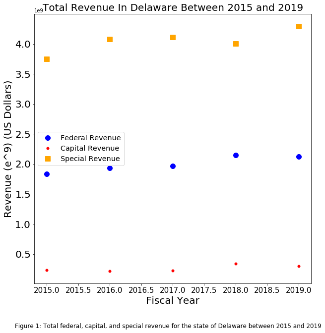

Your notebook is well done and you obviously put work in the processing of the data and in the selection of the topic.

The comparison of revenues is a good idea and a time series as a scatter plot is a fine way to visualize it. 

Your figure is hard to interpret because the y axis range is too large to notice meaningful pattenrs in the data. To fix this you could have nmade 3 plots one over the other thus removing much of the white space between time series. 

I recommand against fractional numbers for the years: you could as well have used only the integer values (controlling the tick labels with ax.set_xticks() or with pl.xticks()) . Similarly, I appreciate that you specified that the units on the y axis are 10^9 but when dealing with dollars the standard is to use words to describe the units: 
an appropriate label would have been "Revenue in billion of USD"

The color scheme is well chosen but the different point size is a bit distracting

